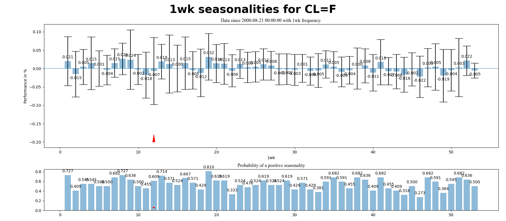

# Seasonality Plotter

**Table of Contents**

[TOCM]

## Seasonalities

Many financial markets exhibit seasonalities (see [Rozeff and Kinney, 1976](http://https://www.sciencedirect.com/science/article/abs/pii/0304405X76900283 "Rozeff and Kinney, 1976")). 
This script creates a plot of a seasonality of an asset using command line.

### Warning:
This script does not account for any trading costs, nor does it clean the data for future roll. 
The results and the backtest (in the function) gives only a rough estimate of the performance, but is not realistic.
Usage on your own risk.

### Command line
`python seasonality_plotter --symbol "CL=F" --interval "1wk" --period "max"`
where symbol can be any symbol on yahoo finance.

- `symbol` takes in a yahoo finance symbol
- `interval` takes in the interval, daily (1d), trading week (5d), weekly (1wk), monthly (1mo)
- `period` takes in the data length, e.g. data since 510 trading days.
- `daily` is an optional parameter and requires using daily intervals. You can decide which seasonality is measured, the weekday (wd, default option) or the day of the month (m). 
- `backtest` creates a very rough backtest without any consideration to cost or execution or asset roll.

### Example for Crude Oil

